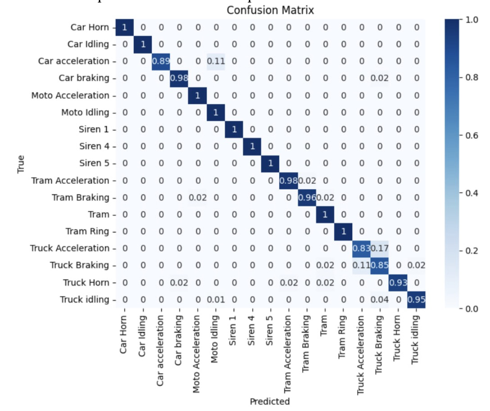
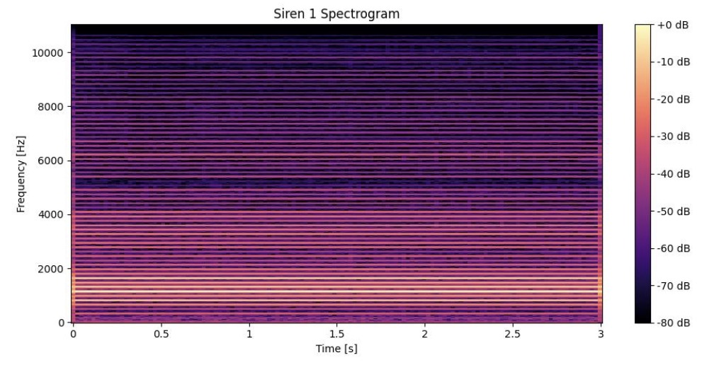
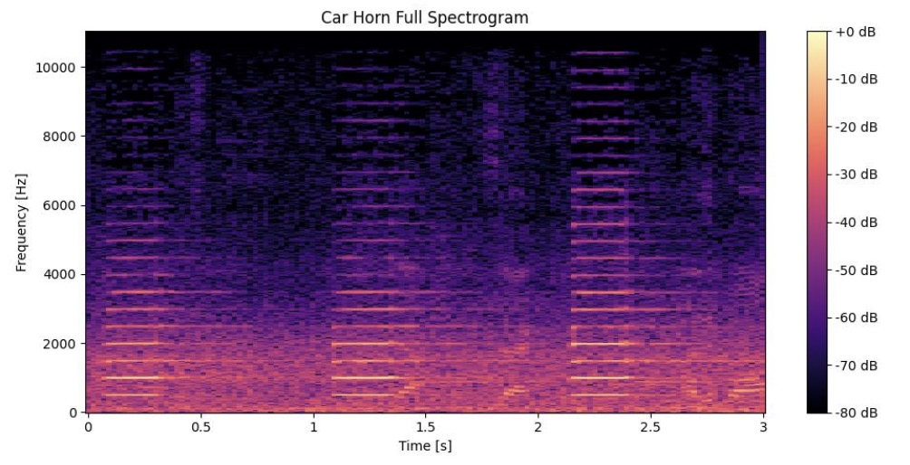

# Classification of vehicle sounds

<!-- A catchy project logo or banner goes here -->
## Main results

## Data
The dataset contains a total of 5374 audio files. These files are labelled into seventeen classes, namely Truck idling, Siren 4, Car Idling, Tram Acceleration, Truck Acceleration, Moto Acceleration, Car Horn, Truck Horn, Siren 5, Truck Braking, Car acceleration, Tram, Moto Idling, Siren 1, Tram Ring, Car braking, Tram Braking, and each of the classes contains 200 to 511 files of 3 seconds in length. 

## Confusion matrix of class prediction

## Spectrograms

